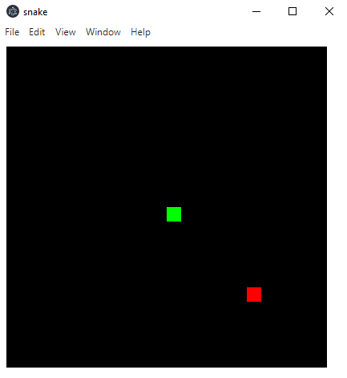
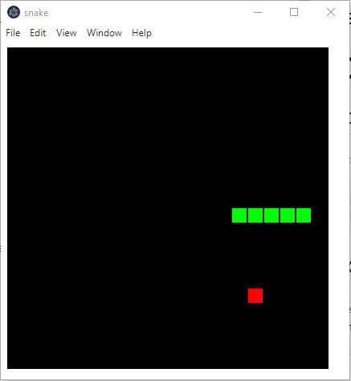

# Snake-Game

A simple snake game written in Typescript

# Requirements

- [Nodejs](https://nodejs.org/es/)
- [NPM](https://www.npmjs.com/) (Usually is included with [Nodejs](https://nodejs.org/es/))

# Download

Simply, clone this repository in a folder in your computer with git

```
git clone https://github.com/JulioDoAr/snake-game.git
```

# Compilation

To compile the project, execute the following commands directly from the project folder:

```
npm install
npm run build
```

**- "npm install" is only required one time. If you have compiled the program before, you dont need it.**

# Execution

To execute the project, clone the repository, open a terminal in the project folder and execute the next two commands:
```
npm install
npm run start
```

**- The command "npm run start" compiles the program too. You dont need to compile the program before.**

# Screenshots
The main view




